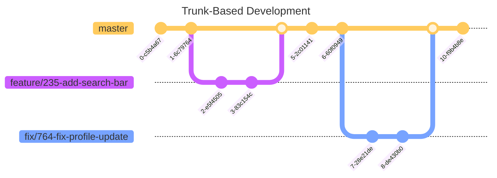

# Trunk based development

## What is Trunk-Based Development?
Trunk-based development (TBD) is a source control workflow model that enables continuous integration.

The primary purpose of trunk-based development is to avoid the creation of long-lived branches by merging partial changes to the entire feature. Developers can achieve this by committing straight to the main branch or by using short-lived branches with an efficient code review process. Branches, by definition, should only live a few days.

If other developers are working on related changes, merging partial changes results in initial feedback, decreases merging complexity, and reduces redundant effort. When the merging process is efficient, the developer does not lose focus by going back and forth between tasks. Because the main branch, also known as the trunk, should be ready to deploy at any time, each modification should not break the build. There are procedures, such as automated testing, feature flags, and branching by abstraction, that enable the team to adopt this methodology.

Benefits of using trunk-based development
1. Complexity is reduced: One of the primary advantages of trunk-based development is the reduced complexity of merging multiple branches into one. This method aims to avoid merge hell, a circumstance in which separate components must be integrated for the first time, resulting in unforeseen bugs, integration challenges, and preventing the team from deploying.

2. Speed of delivery is increased: Implementing and using trunk-based development in the long term could increase team discipline and a feeling of teamwork by establishing clear processes and giving more opportunities for collaboration. According to a Google research, high-performing firms are more likely to use trunk-based development.

3. Feedback loop is shortened: Short feedback loops might also assist validate early design assumptions. Because the trunk should be always stable, the code is potentially releasable to customers for getting early feedback.

